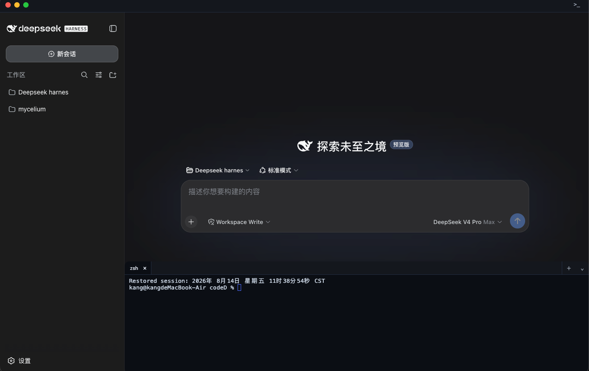
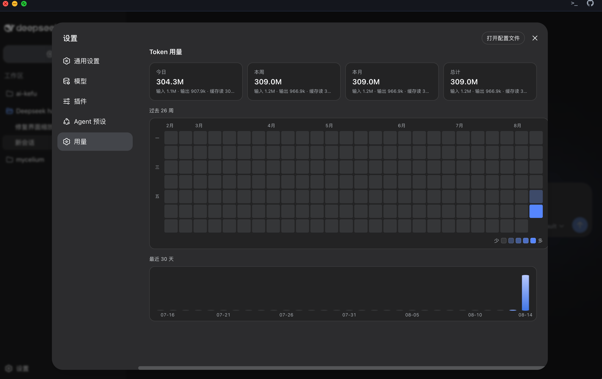

# Dcode

**DeepSeek Harness 的桌面端 · 双击即用，无需终端**

基于 [DeepSeek Harness](https://github.com/deepseek-ai/deepseek-harness) 的一键式桌面外壳。

[特性](#特性) · [亮点](#-亮点) · [安装](#安装) · [使用](#使用) · [技术债](#技术债)

---

Dcode 是官方 DeepSeek Harness 的桌面壳：不用敲任何命令，双击打开，直接进入 Harness
界面。官方负责功能、界面与更新节奏，Dcode 负责启动、窗口与更新三件事——并在其上
额外带来了两个自研能力：**内置终端** 与 **用量统计**。

## 界面

## ✨ 亮点

除官方 Harness 的全部能力之外，Dcode 额外带来了两个我们自研的核心功能——
它们会持续迭代更新，也是我们区别于「命令行 + 浏览器」的最重要的体验升级：

### 🖥️ 内置专业终端

一键呼出、开箱即用的终端面板，彻底告别「另开一个终端窗口」的割裂感：

- 按 `Ctrl+\`` 在窗口底部呼出/收起，或从菜单栏「终端」、状态栏图标进入。
- **多标签页**：`Cmd/Ctrl+T` 新建，可在 zsh / bash / sh 之间切换，也能直接选择
  在某个项目目录或个人目录中打开。
- **全新终端自动落在你最近使用的项目目录**，无需手动 `cd`。
- 内置搜索（`Cmd/Ctrl+F`）、链接识别、右键菜单（复制 / 粘贴 / 全选 / 清屏）、
  拖拽顶栏调整高度。
- 采用与 VS Code / Codex 同款的 xterm 引擎，支持 256 色、光标闪烁、无限回滚。

### 📊 用量统计面板

设置 → 用量，一眼看清你的 token 消耗：

- **GitHub 贡献图同款日历网格**：近半年每天的使用热度一目了然。
- **最近 30 天柱状图**：输入 / 输出 / 缓存读的趋势变化。
- **汇总卡片**：今日 / 本周 / 本月 / 总计的 token 用量，输入 / 输出 / 缓存读分类清晰。
- 支持按 **日 / 周 / 月** 维度切换聚合，鼠标悬停任意格子即可查看当天的详细明细。

### 持续更新中

内置终端与用量统计都是 Dcode 主动新增的能力，会跟随版本持续演进。
欢迎通过 [Issues](../../issues) 反馈你希望补齐的功能。

## 特性

- **双击即用**：打开应用自动启动服务并加载界面，无需终端、无需关心端口。
- **自绘界面**：窗口顶部是 Dcode 自己的菜单栏（终端/视图/帮助）和终端开关按钮，
  没有 Electron 默认菜单；状态栏常驻鱼形图标。
- **内置终端**：见上方「亮点 · 内置专业终端」——多标签、多 shell、搜索、链接识别、
  右键菜单、拖拽调高，新终端自动落在最近项目目录。
- **内置官方源码**：官方 harness 随安装包内置（固定快照），首次启动自动就绪，
  无需联网、无需安装 git/pnpm 等开发环境；官方仓库的任何变动都不会影响你本地
  修改过的源码。
- **用量面板**：见上方「亮点 · 用量统计面板」——日历热力图、30 天柱状图、
  日/周/月/总 token 汇总。
- **被动更新**：后台发现新版本时，只在界面设置图标右侧显示一个
  「更新 vX.Y.Z」按钮——**点击才会下载、安装并重启**，绝不打断正在进行的任务。
- **与命令行版完全兼容**：API Key、配置、会话数据与官方命令行版共享（`~/.dsh`）。

## 安装

1. 在 GitHub [Releases](../../releases) 页面下载最新版本：
   - macOS：`Dcode-x.y.z.dmg`，打开后把 Dcode 拖进「应用程序」
   - Windows：`Dcode-Setup-x.y.z.exe`，双击安装
2. macOS 首次打开若被系统拦截（应用未签名），前往
   「系统设置 → 隐私与安全性」点击「仍要打开」即可。

## 使用

- 打开 Dcode，启动画面完成后即进入 DeepSeek Harness 界面，操作与官方完全一致。
- 终端面板：`Ctrl+\`` 呼出/收起，也可从菜单栏「终端」或状态栏图标的菜单进入；
  `Cmd/Ctrl+T` 新建标签（⌄ 选 shell 或项目目录），`Cmd/Ctrl+F` 终端内搜索；
  关闭标签即结束该 shell，关掉最后一个标签面板自动收起。
- API Key 配置方式与命令行版相同：环境变量、`.env`、`~/.dsh`，也可以在界面中设置。
- 关闭窗口即退出应用，后台服务随之停止，不留残留进程。

## 更新

- 应用在后台每 30 分钟检查一次新版本，**不会自动安装**。
- 发现新版本后，界面设置图标右侧出现「更新 vX.Y.Z」按钮；点击后自动下载
  安装包、安装并重启应用，整个过程不影响你手头正在进行的任务。
- 更新后首次启动若内置 harness 快照有变化，会自动重新解压，等待片刻即可。
- 未签名（或未公证）的 macOS 包，每次自动更新后可能需要在
  「系统设置 → 隐私与安全性」里再允许一次。

## 技术债

以下是我们已知、待后续迭代处理的技术债，记录在此以便追踪（也欢迎贡献者接手）：

- **node-pty 的 `spawn-helper` 执行位丢失**：npm/pnpm 解压 node-pty 预编译包时，
  macOS 所需的 `spawn-helper` 辅助可执行文件常丢失 `x` 权限，导致终端报
  `posix_spawnp failed`。当前已通过在启动时运行时自动修复执行位兜底
  （见 `src/terminal.mjs` 的 `ensureSpawnHelperExecutable`），但根治仍需
  依赖上游修包或改用固定构建流程。
- **pnpm 侵入的杂文件**：仓库根目录会被 pnpm 误生成 `pnpm-lock.yaml` /
  `pnpm-workspace.yaml`，两者尚未纳入 `.gitignore`，需清理并补充忽略规则。
- **harness 为 fork 的子模块**：内置的 `harness/` 是 `deepseek-harness` 的 fork，
  本地改动需手动跟进 upstream，存在 rebase 与合并维护成本。
- **自绘菜单栏的快捷键覆盖不完整**：部分系统级快捷键依赖手写
  `before-input-event` 分发（见 `src/main.mjs`），新增快捷键时需在多处同步。

## 数据与日志

- 配置与会话数据：与官方命令行版共享 `~/.dsh`，两边互见。
- 运行日志（macOS）：`~/Library/Application Support/Dcode/logs/dsh.log`。

## License

[MIT](LICENSE)
